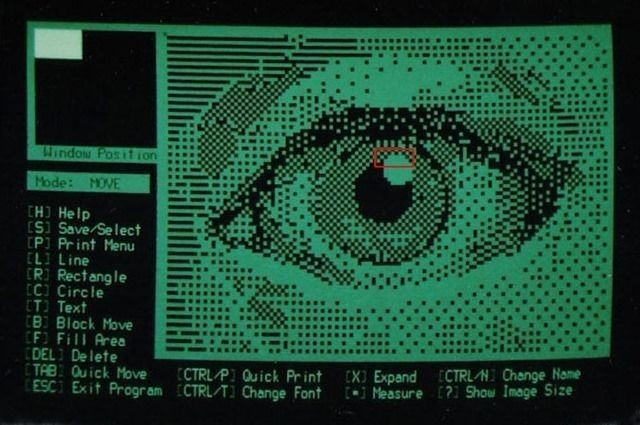

# computer-vision-deeps



## What it does?

Nothing but improving myself actually

## Details for developers

<details>

## 🚀 Quickstart (Local, Requires Docker)

Will be in live soon[kaesit_computer_vision.io]

```bash
# from repo root
docker compose up --build
# open frontend: http://localhost:5173
# API: http://localhost:5000/api/predict?sample=1
# ML service: http://localhost:8000/predict?sample=1
```

---

## ⬇️ Requirements

#### Packages

```bash
uvicorn[standard]
numpy
pandas
scikit-learn
pytest
opencv-python
tensorflow
kaggle
tissue-detection
PyOpenGL
pyvista
scikit-image
glfw
pygame
polars 
pyyaml 
pillow 
psutil 
requests 
scipy 
ultralytics-thop
onnx>=1.12.0,<= 1.19.1
onnxslim>=0.1.71
onnxruntime
```

#### How to install packages:

```bash
pip install -r requirements.txt
```

---

## 🧪 Test

### Test Files

#### how to start the app

Run with:

```bash
uvicorn app:app --reload --host 127.0.0.1 --port 8000
```

#### early_diagnosis_test_from_image.py

Run with:

```bash
python early_diagnosis_test_from_image.py --model MODEL_PATH\<model_name>.pt --test-image PATH_OR_URL
```

#### test_or_diagnosis_from_video_source.py

Run with:

```bash
python early_diagnosis_test_from_image.py --model MODEL_PATH\<model_name>.pt --video-source VIDEO_PATH
```

---

## 🔄 Converters

### Torch → ONNX

Run with:

```bash
python torch_
```
